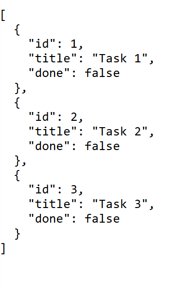
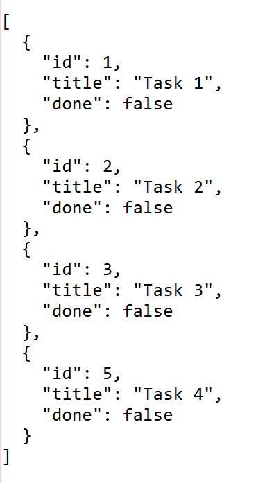

# Task Management CRUD API

A containerized **Task Management CRUD API** built with **Python**, **FastAPI**, **Pydantic**, and **PostgreSQL**, fully orchestrated using **Docker Compose** as part of the **FlyRank Internship**.

---

## Features

-  Full CRUD operations (Create, Read, Update, Delete)
-  Input validation using Pydantic models with dynamic error handling
-  Persistent storage backed by PostgreSQL
-  Containerized architecture with automatic DB initialization & retry logic
-  Interactive OpenAPI / Swagger UI documentation
-  One-command local startup via Docker Compose

---

## Tech Stack

- Python 3.11+
- FastAPI & Uvicorn
- Pydantic
- PostgreSQL & psycopg
- Docker & Docker Compose

---

## Getting Started

### Prerequisites

- Python 3.8 or later

### 1. Clone the Repository

```bash
git clone https://github.com/Shahd-Saleem/Task-Management-CRUD-API.git
```

### 2. Set Up Environment Variables

Copy the example environment file to create your active .env configuration:

```bash
cp .env.example .env
```

### 3. Start the Application Stack

Run the single Docker Compose command to build and launch both the FastAPI application and PostgreSQL database containers:

```bash
docker compose up --build
```

The server will start at:

Base API: http://localhost:8000

Swagger UI Documentation: http://localhost:8000/docs

To stop the running services:

```bash
docker compose down
```

## Table of Endpoints
| **Method** | **Endpoint** | **Description** | **Expected Status Code** |
|---|---|---|---|
| **GET** | `/` | Retrieve API metadata and list of available routes | `200 OK` |
| **GET** | `/health` | Check operational status of the service | `200 OK` |
| **GET** | `/tasks` | Retrieve all stored tasks from database | `200 OK` |
| **GET** | `/tasks/{id}` | Fetch details of a single task by ID from database | `200 OK` / `404 Not Found` |
| **POST** | `/tasks` | Create a new task with validation in the database | `201 Created` / `400 Bad Request` |
| **PUT** | `/tasks/{id}` | Update task title, completed status (`done`), or both in the database| `200 OK` / `400 Bad Request` / `404 Not Found` |
| **DELETE** | `/tasks/{id}` | Remove a task from memory by ID in database | `204 No Content` / `404 Not Found` |

## 🧪 Example API Request

### Update a Task

**Endpoint**

```
PUT /tasks/{id}
```

**'curl -i' Testing**

### Update a Task

```bash
curl -i -X PUT "http://localhost:8000/tasks/1" \
-H "accept: application/json" \
-H "Content-Type: application/json" \
-d '{"done": true}'
```

**Output (Pasted Curl Output)**

```bash
HTTP/1.1 200 OK
date: Tue, 25 Aug 2026 15:30:00 GMT
server: uvicorn
content-length: 33
content-type: application/json

{
  "id": 1,
  "title": "Task 1",
  "done": true
}
```

---

## Database Architecture & Setup

This project uses **PostgreSQL** running inside a dedicated Docker container managed by Docker Compose.

- **Persistence:** Database data is stored persistently using a named Docker volume (`postgres_data`).
- **Auto-Initialization:** The API automatically checks connection status on startup via lifespan handlers and executes table creation and seeding logic automatically.

---

## Screenshots & Database Verification

### Swagger UI Documentation


### Postgres Database View

**Initial Seeded Tasks (`GET /tasks`):**
<p align="center">
  
</p>

**After Adding a New Task using `POST /tasks`:**
<p align="center">
  
</p>