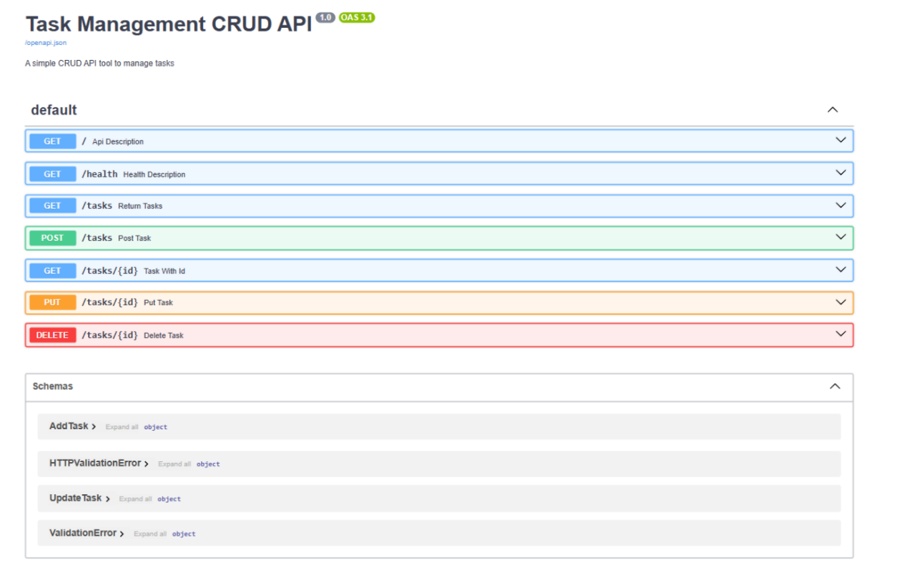
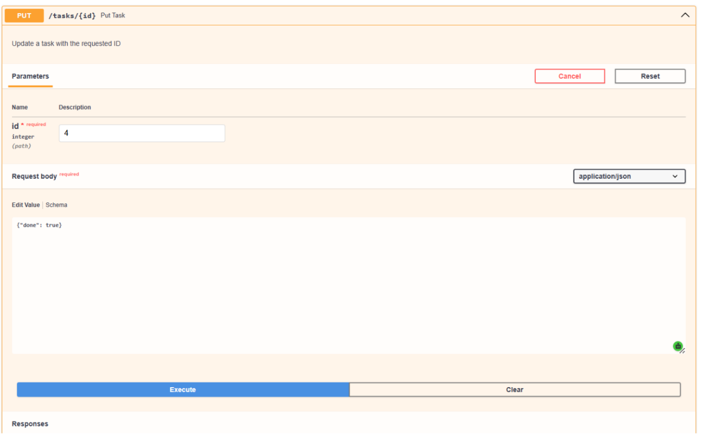
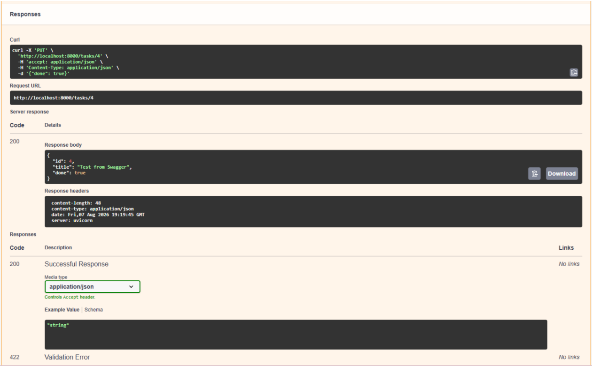

# 📝 Task Management CRUD API

An in-memory **Task Management CRUD API** built with **Python**, **FastAPI**, and **Pydantic** as part of the **FlyRank Internship**. The project provides full CRUD functionality, input validation, dynamic in-memory storage, and interactive API documentation through Swagger UI.

---

## ✨ Features

-  Full CRUD operations (Create, Read, Update, Delete)
-  Input validation using Pydantic models
-  Clear validation error messages
-  Dynamic in-memory task storage
-  Interactive Swagger/OpenAPI documentation
-  Lightweight and easy to run locally

---

## 🛠️ Tech Stack

- Python 3.8+
- FastAPI
- Pydantic
- Uvicorn

---

## 🚀 Getting Started

### Prerequisites

- Python 3.8 or later

### 1. Clone the Repository

```bash
git clone https://github.com/Shahd-Saleem/Task-Management-CRUD-API.git
cd Task-Management-CRUD-API
```

### 2. Create and Activate a Virtual Environment

**Windows (PowerShell)**

```powershell
python -m venv venv
.\venv\Scripts\Activate.ps1
```

**macOS / Linux**

```bash
python -m venv venv
source venv/bin/activate
```

### 3. Install Dependencies

```bash
pip install fastapi uvicorn pydantic
```

### 4. Run the API

```bash
uvicorn main:app --reload
```

The server will start at:

```
http://localhost:8000
```

Interactive API documentation (Swagger UI page) is available at:

```
http://localhost:8000/docs
```

---

## Table of Endpoints
| **Method** | **Endpoint** | **Description** | **Expected Status Code** |
|---|---|---|---|
| **GET** | `/` | Retrieve API metadata and list of available routes | `200 OK` |
| **GET** | `/health` | Check operational status of the service | `200 OK` |
| **GET** | `/tasks` | Retrieve all stored tasks | `200 OK` |
| **GET** | `/tasks/{id}` | Fetch details of a single task by ID | `200 OK` / `404 Not Found` |
| **POST** | `/tasks` | Create a new task with validation | `201 Created` / `400 Bad Request` |
| **PUT** | `/tasks/{id}` | Update task title, completed status (`done`), or both | `200 OK` / `400 Bad Request` / `404 Not Found` |
| **DELETE** | `/tasks/{id}` | Remove a task from memory by ID | `204 No Content` / `404 Not Found` |

## 🧪 Example API Request

### Update a Task

**Endpoint**

```
PUT /tasks/{id}
```

**Curl Testing**

```bash
curl -X PUT "http://localhost:8000/tasks/4" \
-H "accept: application/json" \
-H "Content-Type: application/json" \
-d '{"done": true}'
```

**Output (Pasted Curl Output)**

```json
{
  "id": 4,
  "title": "Test from Swagger",
  "done": true
}
```

---

## 📸 Swagger UI

A screenshot of the Swagger UI page:


An example of a CRUD request working:



## DB Browser for SQLite View
SQL Query: 
UPDATE tasks SET done = 1; 

Before Changes:


After Changes:
